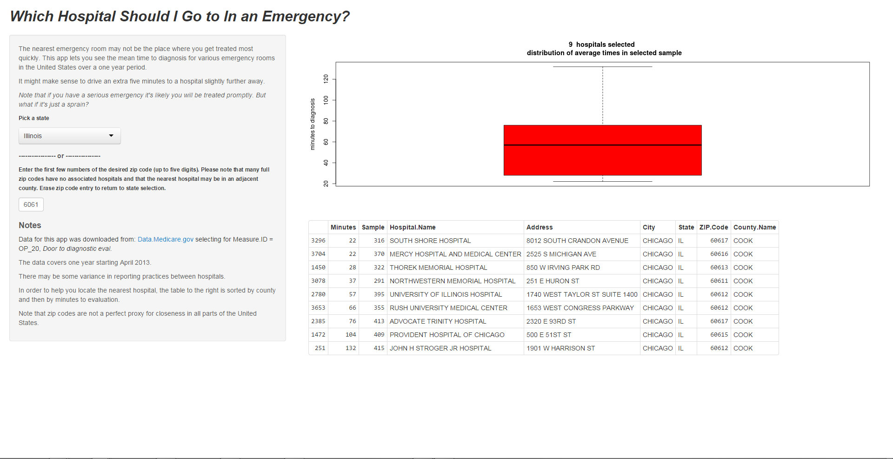

Minimizing Delays in Emergency Room Visits
========================================================
author: R. Srivastav
date: January 25, 2015

What's the Rush?
========================================================

### Have you ever taken a sick or injured child to an emergency room?

- You might have to wait for people with more critical needs
- Not all emergency rooms are equally efficient
- You might be able to save time by going to a hospital just a few extra minutes away

Visit: http://Sriraman5.shinyapps.io/timelycare/

Locate a Hospital by State
========================================================
Narrow your search using partial zip codes


For example, entering <6061> the first four digits of a zip code in Chicago yields statistics on nine hospitals.


```r
selected <- 6061 == raw$ZIP.Code %/% 10
print(raw[selected,dispcols],row.names=F)
```

```
 Minutes                     Hospital.Name
      22              SOUTH SHORE HOSPITAL
      22 MERCY HOSPITAL AND MEDICAL CENTER
      28          THOREK MEMORIAL HOSPITAL
      37    NORTHWESTERN MEMORIAL HOSPITAL
      57   UNIVERSITY OF ILLINOIS HOSPITAL
      66    RUSH UNIVERSITY MEDICAL CENTER
      76         ADVOCATE TRINITY HOSPITAL
     104     PROVIDENT HOSPITAL OF CHICAGO
     132        JOHN H STROGER JR HOSPITAL
```

The Actual Site - Much Prettier!
========================================================


Data Sources and Caveats
========================================================

Data for this app was downloaded from: 

http://Data.Medicare.gov 

selecting for Measure.ID = OP20, _Door to Diagnostic Eval_

- The data covers one year starting April 2013.
- There may be some variance in reporting practices between hospitals.
- Zip codes are not a perfect proxy for closeness in all parts of the United States.

__Note that if you have a serious emergency it's likely you will be treated promptly anywhere.__

